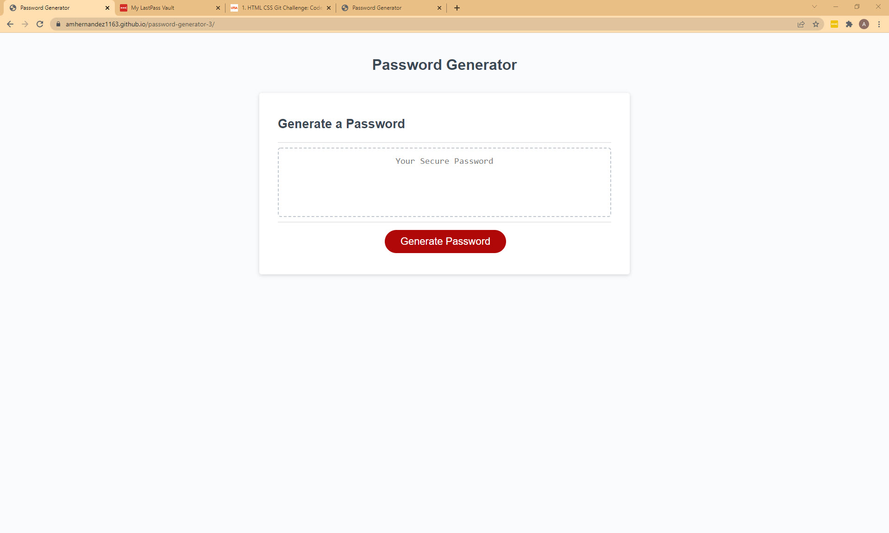

In Challenge Three of the UTSA Coding Bootcamp, we were given a directive of creating a functional password generator. In the Acceptance Criteria provided, the user was to be met with a series of prompts, and a password would generate with their speicifed inputs. 

This was an individual assignment, so the code is written by me. However, I did have guidance on the randomize portion of the code from our #AskBSC Learning Assistant, Diana. UTSA provided starter code for this Challenge from Xandromus on GitHub.

This was our first week digging into JavaScript -- & it is no easy feat! The best part is the moment of victory after figuring out something difficult. I'm happy to be on the other side now. 

All changes were done in VS Studio Code, Added/Committed/Pushed up from GitBash and sent to a GitHub repository found here: https://github.com/amhernandez1163/password-generator-3

GitHub also hosts my URL for changes made to be displayed: https://amhernandez1163.github.io/password-generator-3/ 

